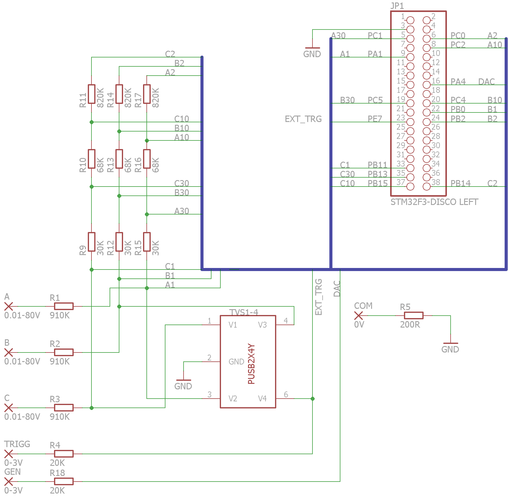

## Open-Source Oscilloscope based on STM32F3-DISCOVERY board

Some ideas got from Tomasz Ostrowski's [Miniscope](http://tomeko.net/miniscope_v4/index.php?lang=en).
Tomasz has a bunch of ready-to-use-devices, and I have the only preliminary schematics and raw prototype.

The main idea is to build PC-oscilloscope. Hardware is ST Microelectronics development board
[STM32F3-DISCOVERY](http://www.st.com/web/catalog/tools/FM116/SC959/SS1532/PF254044) plus small additional board with simple protection circuits and basic voltage dividers.

A special Java web server + web browser is supposed to be a PC part of the system.

### License:
[MIT](license.txt)

### Hardware variants
* Naked Discovery(Nucleo)
 * _No overvoltage protection_
 * Input voltage: 0..3V uni-polar
* Shield board + Discovery(Nucleo)
 * Overvoltage protection
 * Input voltage: 0..45V uni-polar
 * Input impedance ~1MOhm

### Features(Milestone 0.x):
* Something working 
* PC connectivity - USB + java web server + browser

### Features(Milestone 1):
* PC connectivity - USB
* Platform independent desktop (Java app+browser)
* Minimal voltage resolution 46&mu;V
* Internal SYNC
* Simple signal generator 
* 12-bit sampling
* Channel GAIN up to x16
* One channel
* Up to 5M samples/sec

### Features(Milestone 2):
* Three channels

### Features(Milestone 3):
* Wifi connectivity via ESP8266 instead of USB, 
* Virtual ground
* Battery power

### Features(Milestone 4):
* One or two channels

### Features(Milestone X):
* Nucleo-F303RE board support
* External SYNC

### Add-on board:

