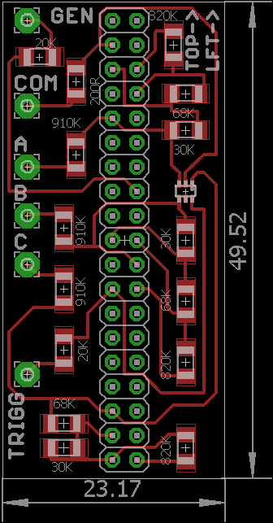

## Open-Source Oscilloscope based on STM32F3-DISCOVERY board

Some ideas got from Tomasz Ostrowski's [Miniscope](http://tomeko.net/miniscope_v4/index.php?lang=en).
Tomasz has a bunch of ready-to-use-devices, and I have the only preliminary schematics and raw prototype.

The main idea is to build PC-oscilloscope. Hardware is ST Microelectronics development board
[STM32F3-DISCOVERY](http://www.st.com/web/catalog/tools/FM116/SC959/SS1532/PF254044) plus small additional board with simple protection circuits and basic voltage dividers.

A special Java application or web browser is supposed to be a PC part of the system.

## DISCLAIMER

**! WARNING !**

Read [SAFETY DISCLAIMER](DISCLAIMER.txt) before using any of materials listed here.  

### License:
[MIT](license.txt)

### Hardware variants
* Naked Discovery(Nucleo)
 * _No overvoltage protection_
 * Input voltage: 0..3V uni-polar
* Shield board + Discovery(Nucleo)
 * Overvoltage protection
 * Input voltage: 0..45V uni-polar
 * Input impedance ~1MOhm

### Usage HOWTO
See [USAGE.txt](USAGE.txt)

### Build HOWTO

#### Required tools
* cmake 3.7.x
* arm-none-eabi-gcc 5.4 + binutils
* java 8
* maven 3.3
* *[Optional]* dfu-tool 0.8.1 

#### Build client
* `cd client`
* `mvn clean install`

Build firmware
----
* `mkdir build`
* `cd build`
    * `cmake -DCMAKE_TOOLCHAIN_FILE=STM32F303xC.cmake ..`
* `make`
* *[Optional step]* `make dfu`

### Roadmap
See [ROADMAP.md](ROADMAP.md)

### Add-on board:

